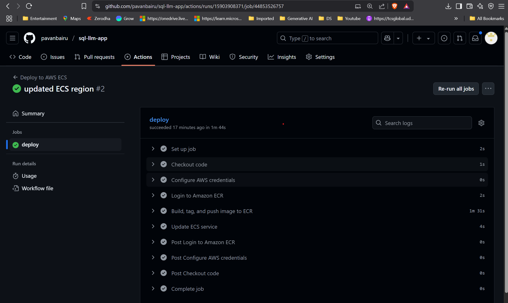
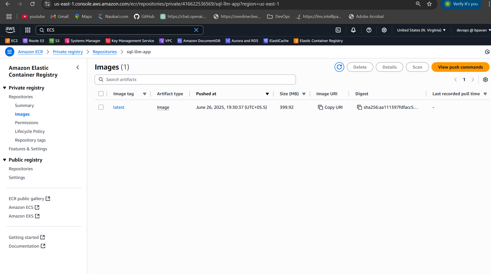
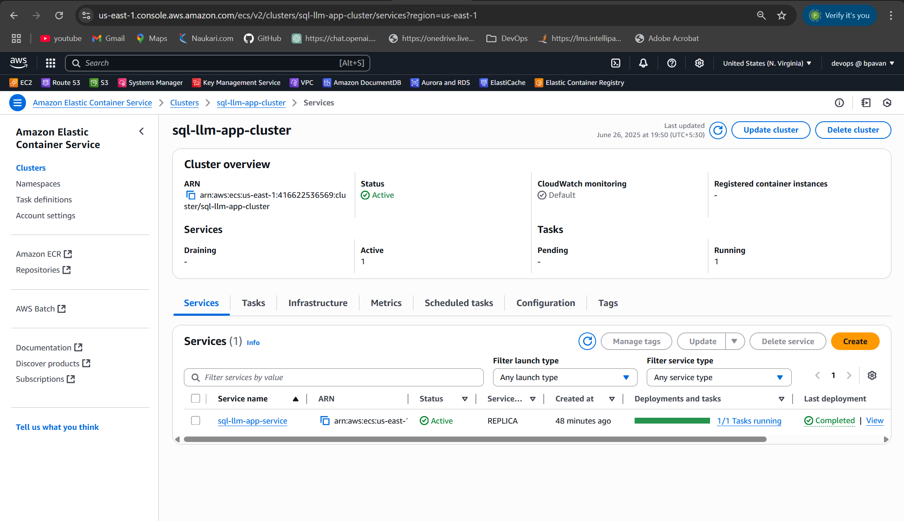
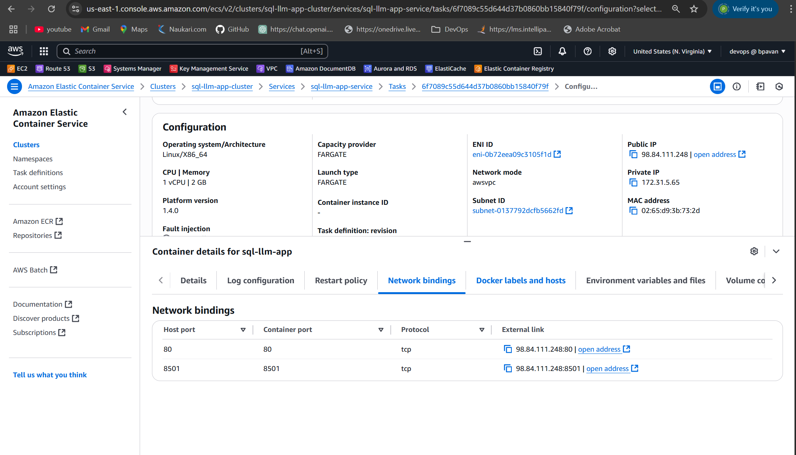
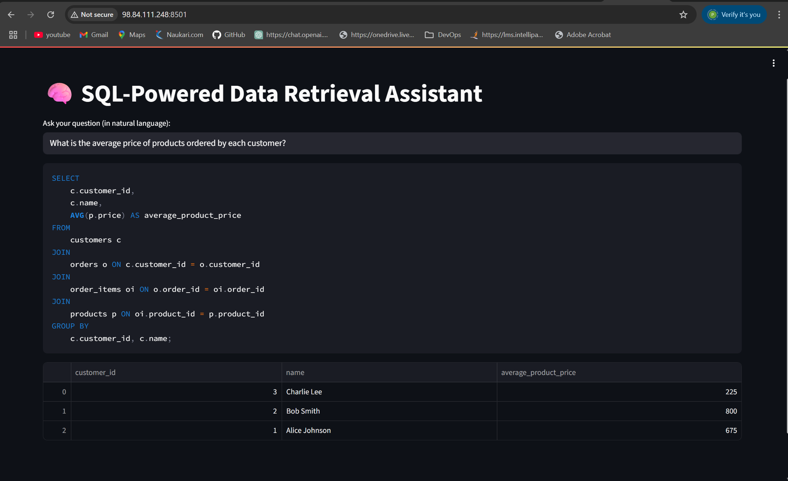

# 🧠 SQL-LLM-App

A **Streamlit-based application** that converts **natural language queries** into **SQL** using **EURI's LLM** and executes them against a **Neon PostgreSQL** database.

---

## 📦 Prerequisites

- Python 3.10+
- Docker
- GitHub account (for CI/CD deployment)
- EuriAI API key (EURIAI-based)
- Neon database account
- AWS account with ECR and ECS access

---

## ⚙️ Local Setup

### 1. Clone the repository

```bash
git clone https://github.com/pavanbairu/sql-llm-app.git
cd sql-llm-app
```

### 2. Create `.env` file inside the `app/` folder

```bash
# app/.env
EURIAI_API_KEY=<your-euriai-api-key>
DATABASE_URI=postgresql://neondb_owner:<your-neon-password>@ep-cool-mode-a4i17css-pooler.us-east-1.aws.neon.tech/neondb?sslmode=require
```

### 3. Install Python dependencies

```bash
cd app
pip install -r requirements.txt
```

### 4. Run locally without Docker

```bash
streamlit run main.py
```

### 5. Run with Docker

```bash
cd ..
docker build -t sql-llm-app .
docker run -p 8501:8501 --env-file app/.env sql-llm-app
```

### 6. Open App

Visit: [http://localhost:8501](http://localhost:8501)

---

## 🚀 CI/CD Deployment to AWS ECS (Fargate) with GitHub Actions

On every push to the `main` branch, GitHub Actions will:

1. Build and push your Docker image to Amazon ECR
2. Trigger a new deployment on ECS with the latest image

---

## 📁 GitHub Actions Workflow File

File path: `.github/workflows/deploy.yml`

---

## 🔐 GitHub Secrets to Add

Go to **GitHub > Repo > Settings > Secrets and variables > Actions**, then add:

| Secret Name               | Description                                  |
|---------------------------|----------------------------------------------|
| `AWS_ACCESS_KEY_ID`       | Your IAM user's access key ID                |
| `AWS_SECRET_ACCESS_KEY`   | Your IAM user's secret access key            |
| `AWS_ECR_LOGIN_URI`       | ECR URI (e.g., `123456789012.dkr.ecr.us-east-1.amazonaws.com`) |
| `ECR_REPOSITORY_NAME`     | ECR repo name (e.g., `sql-llm-app`)          |
| `AWS_ECS_CLUSTER_NAME`    | ECS cluster name (e.g., `sql-llm-app-cluster`) |
| `AWS_ECS_SERVICE_NAME`    | ECS service name (e.g., `sql-llm-app-service`) |

---

## 🖼️ Deployment Proof (Add Your Screenshots)

### ✅ 1. GitHub Actions - Workflow Success  
📸   


### ✅ 2. Amazon ECR - Image Pushed  
📸 


### ✅ 3. ECS Cluster & Service Running  
📸 


### ✅ 4. App Live at Public IP  
📸 



---

## 📌 Notes

- For production, consider:
  - Using **AWS Secrets Manager** instead of `.env`.
  - Adding **HTTPS** via **ACM + Load Balancer**.
  - Configuring **Auto Scaling** policies.
- View logs in **CloudWatch Logs > /ecs/sql-llm-app**

---

## 👨‍💻 Author

**Pavan Bairu**  
Mainframe Developer | ML & Cloud Enthusiast  
[GitHub: pavanbairu](https://github.com/pavanbairu)
